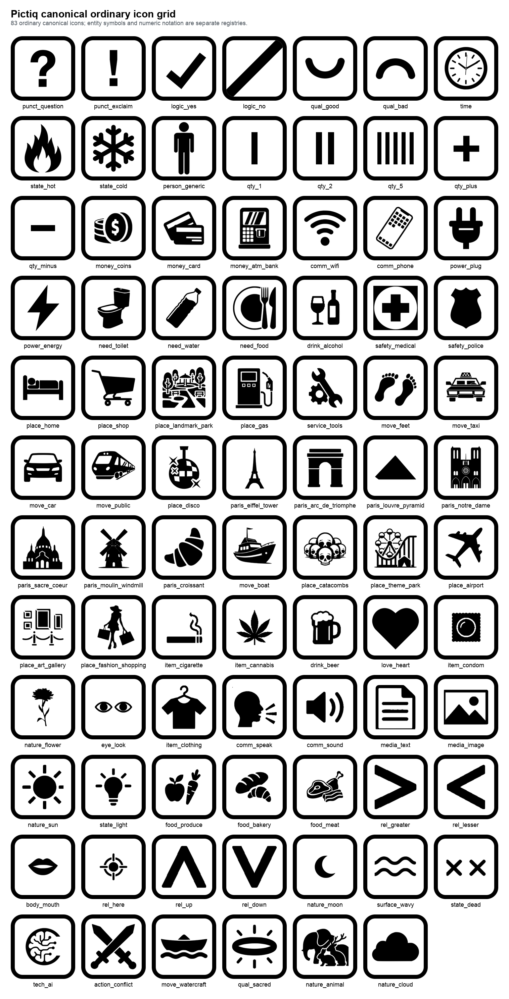

# PICTIQ

**Minimal visual protocol for short messages across language barriers.**

Pictiq is designed for pointing, quick signs, stickers, portable communication surfaces, and short composable phrases. It is not intended to replace natural language or long-form writing.

All lexicon words are designed as framed tiles (rounded-square frame). The Pictiq logo is not a tile.

## Pictiq Handbook v1.0

  

  
  
  

**Pictiq: A Visual Protocol for Short Messages**
by Anton Biletskyi-Volokh

A free 95-page illustrated field guide covering:

- protocol rules and the Core lexicon
- context packs and the Paris case
- shirts, wallet cards, lighter, luggage-tag, and phone-lockscreen layouts
- visual storytelling and poetry experiments
- computer-vision and language-model concepts

## Core idea
- Zero-intent: pointing at an object tile is a valid message by default (“this / need this / where is this”).
- Meaning is amplified using punctuation tiles and context.
- Negation is expressed as `X + logic_no` (and `logic_no` can be a standalone answer).
- Some nouns may act as actions depending on context (e.g., transport = ride, coins = pay).

## Canonical overview

Point to a tile. Add `punct_question` to ask, `punct_exclaim` for urgency, and `logic_no` to negate.
The current canonical registry contains **83 ordinary icons**, including lexical tiles, evaluation modifiers, quantities, relational operators, `surface_wavy`, `state_dead`, the five accepted Odyssey Stress Test 03 Stage 2A primitives, and the post-audit `food_meat` primitive. Canonical does not mean Core: the accepted classification separates Core, Standalone Core, Contextual, Specialized, and Mechanism roles.

  

Printable PDF: [`docs/overview/pictiq-core-grid.pdf`](docs/overview/pictiq-core-grid.pdf)

## Start here
- Handbook: `books/handbook-v1/`
- Protocol rules (EN): `spec/PROTOCOL.md`
- Icon drawing brief (EN): `spec/ICON_DEFINITIONS.md`
- Emoji bridge policy: `spec/EMOJI_BRIDGE.md`
- Protocol rules (RU): `spec/PROTOCOL.ru.md`
- Icon drawing brief (RU): `spec/ICON_DEFINITIONS.ru.md`
- Style spec: `spec/ICON_SPEC.md`
- Grammar spec: `spec/GRAMMAR.md`
- Numeric notation: `spec/NUMERIC_NOTATION.md` and `notation/numeric/index.json`
- Silhouette input rules: `spec/SILHOUETTE_INPUTS.md`
- Logo and branding assets: `branding/`
- Lexicon registry: `lexicon/icon-index.json`
- Vocabulary classification: `lexicon/vocabulary-classification.json` and `spec/VOCABULARY_CLASSIFICATION.md`
- Entity-symbol registry: `entities/entity-index.json`
- Packs: `packs/universal-core.json`, `packs/universal-v1.json`
- Static dictionary site (GitHub Pages): `docs/`

Canonical overview artifacts: `docs/overview/pictiq-core-grid.png` and `docs/overview/pictiq-core-grid.pdf` (historical filename retained).
Core protocol release: `v1.0.0-core`

**Perceptual design (v1.0.1)**

Pictiq treats technical SVG validity and perceptual recognition as separate requirements. The [perceptual design principles and visual QA workflow](spec/ICON_SPEC.md#perceptual-design-principles) guide evaluation at multiple scales and in representative layouts.

**Communication modes (v1.0.2)**

Pictiq now distinguishes [Embodied Communication from Standalone Communication](spec/PROTOCOL.md#11-embodied-and-standalone-communication). Live pointing, gaze, gesture, voice, visible objects, and shared context can make a tile unnecessary; signs, cards, stickers, screens, and remote instructions must preserve the same meaning after the communicator is gone.

Meaning may enter a message through [lexical tiles, modifiers/operators, parametric tiles, entity symbols, or embodied references](spec/PROTOCOL.md#12-communication-primitive-classes). Standalone Batches A, B, and C are implemented and accepted; parametric COLOR remains under evaluation, and entity symbols now have an accepted pilot registry.

The single canonical lexicon can be selected through an [Embodied Profile](spec/PROFILES.md#embodied-profile) for person-present communication or a [Standalone Profile](spec/PROFILES.md#standalone-profile) for durable/remote communication. Context packs layer on either profile; they are not separate icon libraries.

Pictiq currently scales through five distinct layers: the 83-identifier ordinary canonical registry, the 82 active ordinary semantic concepts retained after compatibility cleanup, Core vocabulary, context packs/profiles, and the 11-example entity registry for specific named entities or visual proper names. Entity registry growth does not increase the ordinary vocabulary count.

### Research
- [Toki Pona interoperability research](https://github.com/markoblogo/toki-pona-translator) compares the 120-word Toki Pona core vocabulary, sitelen pona, sitelen emoji, and the current Pictiq lexicon as a semantic and interoperability stress test—not as evidence of historical influence or lexical equivalence.
- Historical reference: [Jock Kinneir and Margaret Calvert’s British road-sign programme](spec/ICON_SPEC.md#reference-systems), identified after Pictiq v1.0.
- Related systems: `docs/research/related-systems.md`
- Emoji bridge: `docs/research/emoji-bridge.md`
- Tiny Languages Protocol note: `docs/research/tiny-languages-protocol.md`
- Inclusive-design and application-domain harvest: `docs/book-materials/research/perplexity-inclusive-design-and-use-cases-harvest-2026-09.md`

## Repository structure
- `/books` — published handbook editions and release artwork
- `/spec` — protocol rules, grammar, and icon design definitions
- `/lexicon` — icon registry (metadata index + schema)
- `/entities` — scoped visual proper-name examples and registry
- `/packs` — curated icon packs (core and extensions)
- `/icons` — canonical SVG icons + exported PNGs
- `/layouts` — reusable content profiles and physical representations
- `/profiles` — recommended Embodied and Standalone vocabulary profiles
- `/templates` — tile template for icon authoring
- `/tools` — validation and SVG→PNG rendering scripts
- `/docs` — static dictionary site (GitHub Pages-ready)
- `/releases` — release-note sources

## Tooling & CI
- `tools/validate_lexicon.py` validates lexicon metadata, packs, profiles, SVG references, and i18n data.
- `tools/validate_vocabulary_classification.py` validates vocabulary role classification against the canonical lexicon and separate entity registry.
- `tools/validate_numeric_notation.py` validates the numeric notation registry and path-based digit/number SVG assets.
- `tools/validate_svg.py` validates canonical SVG rules, including the standard viewBox and `currentColor` use.
- `tools/validate_entities.py` validates scoped entity-symbol metadata and SVG assets.
- Layout generators produce wallet cards, luggage tags, phone lockscreens, lighter artwork, and documentation overviews from content profiles.
- GitHub Actions runs validation on push and pull requests.

## Licensing (summary)
- Personal use is allowed.
- Non-commercial use is allowed under `LICENSE` (CC BY-NC 4.0).
- Commercial use requires a separate agreement: see `COMMERCIAL_LICENSE.md`.

## Status
The Core protocol and the first Pictiq Handbook are published. The lexicon, context packs, profiles, layouts, and machine-readable experiments remain under active development.
