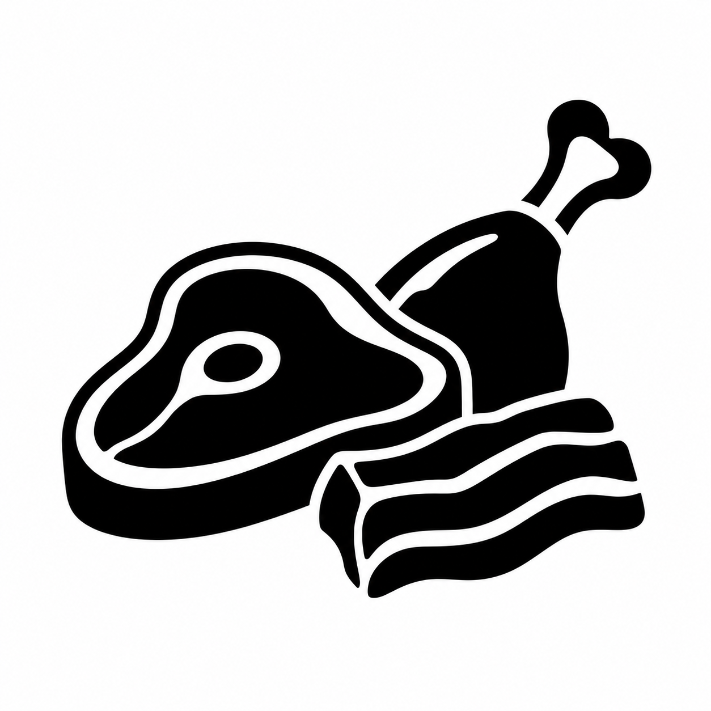

# Architecture & Vocabulary Audit QA — food_meat

Human-accepted source reference → canonical SVG → small-size checks. The generated HTML review sheet is local at `build/qa/food_meat.html`.

| Reference | Canonical asset | Comparison context |
| --- | --- | --- |
|  |  | `need_food`, `food_produce`, `food_bakery`, `nature_animal`, `place_shop`, `state_hot` |

Acceptance notes: compact overlapping silhouettes preserve steak, drumstick/shank, and strip/cut forms; adapted only to canonical frame, safe area, `currentColor`, and complete silhouettes. No narrower meat primitives were added.
